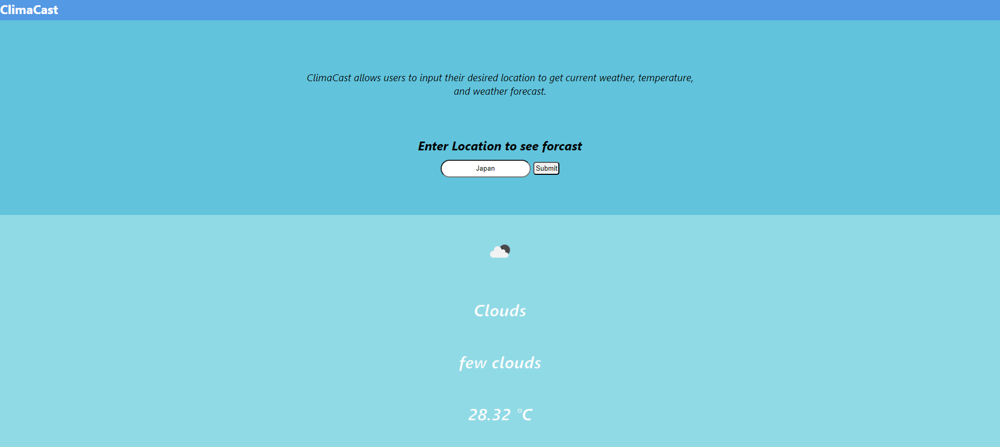

# ClimaCast

<b>Project Overview:</b>

ClimaCast is a weather reporting web application through the utilization of JavaScript and the React framework. This application allows users to input their desired location and prompting the application to render real-time data like the current weather and temperature specific to the designated location.

<b>How to Run:</b>
<ol>
  <li> Clone Repository</li>
  <li> Make sure nodejs and npm are installed on local machine</li>
  <li> Enter "npm install" in terminal while inside project path.</li>
  <li> Enter "npm start" in terminal to start up the react app on the browser</li>
</ol>
